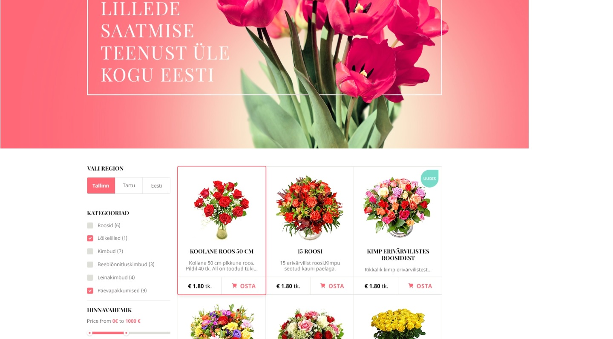

# Flowers e-shop

_website project_

<br>

## 🌟 About

This project is the final project of the course.
The project is built using React, CRUD, API.

Site published at:

Design: [LillePood](https://dribbble.com/shots/1837415-Lillepood/attachments/306645?mode=media)



## 🎯 Project features/goals

- Github pages
- responsive design
- form
- react
- favicon
- navigation
- routers
- animations
- condition rendering
- gallery
- slider
- adaptability
- work ethic
- time management

## 🧰 Getting Started

### 💻 Prerequisites

Node.js - _download and install_

```
https://nodejs.org
```

Git - _download and install_

```
https://git-scm.com
```

React - _run React_

```
npm install
```

```
cd flowers-eshop
```

```
npm start
```

### 🧪 Running tests

There is no tests for this project.

## 🌞 Authors

Simona: [Github](https://github.com/simonasablinaite/FEU7/tree/master/final-assignment/flowers-eshop)

## ⚠️ License

Distributed under the MIT License. See LICENSE.txt for more information.
